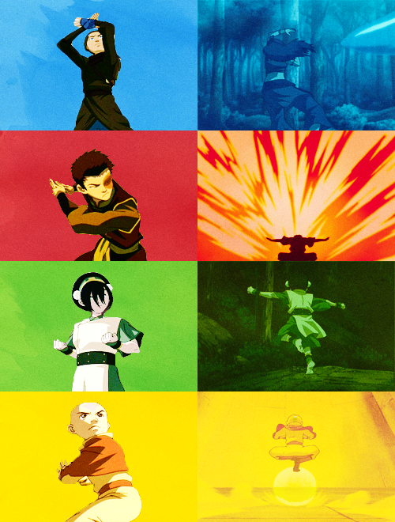

```{r, warning = FALSE, message = FALSE}
library(dplyr)
library(ggplot2)
library(tidytext)
library(rtweet)

load("data/transcripts.RData")
load("data/ratings.RData")
```

## Proposta inicial

Inicialmente, minha ideia era utilizar dados do twitter (texto e hora do tweet) de alguma partida de futebol e comparar a frequência de determinadas palavras com os eventos do jogo. 

No entanto, um problema que surgiu foi que a api gratuita do tweet aparentemente não retorna tweets de maneira constante ao decorrer da partida. Segue um exemplo em que temos tweets apenas para alguns intervalos de tempo do jogo.
```{r}
tweets = parse_stream("CEAxFLU.json")
ts_plot(tweets, by = "mins") + # função do rtweet que utiliza o ggplot
  theme_bw()
```

Este problema me fez desistir da proposta inicial e buscar outras opções para o trabalho final.

## Nova proposta

Alguns meses atrás, navegando no Reddit, encontrei uma visualização que me chamou bastante atenção:


na época, eu estava estudando mineração de textos e tive a ideia de utilizar métodos de text mining para buscar palavras que identifiquem cada personagem e avaliar a relação entre a quantidade de falas de um personagem em um episódio com a nota do episódio no IMDB. Como eu nunca assisti The Office, a série desta visualização, decidi utilizar os dados da série 
<a href="https://en.wikipedia.org/wiki/Avatar:_The_Last_Airbender">Avatar: The Last Airbender (ATLA)</a>.

## Datasets

Os datasets que serão utilizados são:

+ O script dos 61 episódios do ATLA disponível em: http://avatar.wikia.com/wiki/Avatar_Wiki:Transcripts;

+ As notas do IMDB desta série que pode ser encontrada em: https://www.imdb.com/title/tt0417299/.

Ambos os conjuntos de dados foram coletados via web scraping. O código do scrape está no arquivo *scrape.R*.

Colunas do data frame dos roteiros
```{r}
glimpse(transcripts)
```

Notas dos episódios
```{r}
ratings
```

## Principais palavras por personagem

Inicialmente, realizarei um pre-processamento nos textos, removerei as introduções e tudo que estiver entre colchetes.

Exemplo de texto antes da limpeza
```{r}
transcripts$text[2]
```

```{r}
intro = transcripts$text[1]

transcripts = transcripts %>%
  filter(text != intro) %>% # tirando as introducoes
  mutate(text = stringr::str_replace_all(text, '\\[(.*?)\\]', ''), # tirando o que ta entre colchetes
         text = qdapRegex::rm_number(text))
```

Exemplo de texto depois da limpeza
```{r}
transcripts$text[1] # índice 1 pois removi a introdução
```

Agora, colocarei o texto no formato de um data frame de uma palavra por linha, com todas as palavras em caixa baixa e removerei as seguintes stop words
```{r}
sort(unique(stop_words$word))
```

```{r}
ut = transcripts %>%
  unnest_tokens(word, text) %>% 
  anti_join(stop_words) # retirando stop words
```

```{r}
glimpse(ut)
```

Contagem de palavras por personagem (após remoção de stop words):
```{r}
count_speaker = ut %>%
  count(speaker) %>%
  arrange(desc(n))
count_speaker
```

```{r, fig.width = 10, warning = FALSE}
count_speaker$Selecionado = "Não"
count_speaker$Selecionado[1:18] = "Sim"
count_speaker %>%
  mutate(speaker = factor(speaker, levels = speaker)) %>%
  head(36) %>%
  ggplot(aes(x = speaker, y = n, alpha = Selecionado)) +
  geom_bar(stat = "identity") +
  xlab("Personagem") +
  ylab("Quantidade de palavras") +
  theme_bw() +
  theme(axis.text.x = element_text(angle = 90, vjust = 0.3)) +
  scale_alpha_discrete(range = c(0.4, 0.9)) +
  ggtitle("Palavras por personagens e personagens selecionados") +
  guides(alpha = guide_legend(reverse = TRUE))
```

Optei por utilizar apenas os 18 personagens com maior número de palavras e calcular as palavras mais utilizadas e a medida tf-idf considerando cada personagem como um documento. A medida tf-idf nos permite avaliar palavras que caracterizam um determinado documento, neste caso personagem, em relação a um conjunto de documentos. Ela é calculada da seguinte forma:

$$ w_{t,d} = \frac{tf_{t,d}}{\sum_{t' \in d}f_{t',d}} \times log \Bigg( \frac{N}{n_t} \Bigg) $$

em que

+ $w_{t,d}$ é o valor do o peso \textit{tf-idf} para o termo $t$ no documento $d$;

+ $tf_{t,d}$ é a quantidade de vezes que o termo $t$ aparece no documento $d$;

+ $\sum_{t' \in d}f_{t',d}$ é a quantidade total de termos do documento $d$;

+ $N$ é o número total de documentos;

+ $n_t$ é o número de documentos que contém o termo $t$.

```{r}
personagens = count_speaker$speaker[1:18]

tfidf = ut %>%
  filter(speaker %in% personagens) %>%
  count(word, speaker) %>%
  bind_tf_idf(word, speaker, n) %>%
  arrange(desc(tf_idf))
```

Visualizando as palavras mais utilizadas e os maiores tf-idf por personagem
```{r}
tmp1 = tibble(speaker = count_speaker$speaker[1:18], 
                   order_speaker = 1:18)

tmp2 = tfidf %>%
  inner_join(tmp1) %>%
  mutate(speaker = reorder(speaker, order_speaker)) %>%
  arrange(speaker, desc(n)) %>%
  group_by(speaker) %>%
  do(head(., 10)) %>%
  ungroup() %>%
  arrange(speaker, n) %>%
  mutate(order_word = row_number())

tmp3 = tfidf %>%
  inner_join(tmp1) %>%
  mutate(speaker = reorder(speaker, order_speaker)) %>%
  arrange(speaker, desc(tf_idf)) %>%
  group_by(speaker) %>%
  do(head(., 10)) %>%
  ungroup() %>%
  arrange(speaker, tf_idf) %>%
  mutate(order_word = row_number())
```

Selecionando cores das nações com uso do https://imagecolorpicker.com/ e a partir da imagem


```{r}
water = "#27A3EB"
fire = "#D7333C"
earth = "#6FCC36"
#air = "#FFE700"
air = "gold1"
```

```{r, fig.width = 10, fig.height = 10}
ggplot(tmp2, aes(order_word, n, fill = speaker)) +
  geom_bar(stat = "identity", show.legend = FALSE) +
  facet_wrap(~ speaker, scales = "free", ncol = 6) +
  theme_bw() +
  scale_x_continuous(breaks = tmp2$order_word, labels = tmp2$word) +
  scale_y_continuous(breaks = scales::pretty_breaks(2)) +
  coord_flip() +
  labs(title = "Palavras mais utilizadas por personagens",
       x = NULL,
       y = "n") +
  scale_fill_manual(values = c(water, air, water, fire, fire, earth,
                               fire, fire, earth, water, air, fire,
                               fire, earth, water, earth, earth, fire))
```

```{r, fig.width = 10, fig.height = 10}
ggplot(tmp3, aes(order_word, tf_idf, fill = speaker)) +
  geom_bar(stat = "identity", show.legend = FALSE) +
  facet_wrap(~ speaker, scales = "free", ncol = 6) +
  xlab("words") +
  ylab("tf-idf") +
  theme_bw() +
  scale_x_continuous(breaks = tmp3$order_word, labels = tmp3$word) +
  scale_y_continuous(breaks = scales::pretty_breaks(2)) +
  coord_flip() +
   labs(title = "Palavras com maiores tf-idf por personagem",
       x = NULL,
       y = "tf-idf") +
  scale_fill_manual(values = c(water, air, water, fire, fire, earth,
                               fire, fire, earth, water, air, fire,
                               fire, earth, water, earth, earth, fire))
```

## Relação entre a proporção de falas dos personagens e notas do IMDB

Primeiramente, agrupei as informações das notas com a base do roteiro e criei uma variável para indicar a fração da quantidade de falas dos personagens em relação ao total de falas do episódio.
```{r}
tmp = tibble(epi_num = unique(transcripts$epi_num), rating = ratings)

prop = transcripts %>%
  inner_join(tmp) %>%
  filter(speaker %in% personagens) %>%
  count(epi_num, rating, speaker) %>%
  group_by(epi_num) %>%
  mutate(prop = n/sum(n))

glimpse(prop)
```
Por exemplo o personagem Aang tem 47 falas no eísódio 1, o que corresponde a aproximadamente 32,6% das falas deste episódio.

Posteriormente, criei uma base com as notas dos episódios.
```{r}
episodios = tibble(Episódio = as.factor(1:61), 
                   Nota = ratings, 
                   Temporada = as.factor(c(rep(1, 20), rep(2, 20), rep(3, 21))))

episodios %>%
  ggplot(aes(x = Episódio, y = Nota, fill = Temporada)) +
  geom_bar(stat = "identity") +
  scale_fill_manual(values = c(water, earth, fire)) +
  theme_bw() +
  coord_cartesian(ylim = c(7, 10)) +
  scale_x_discrete(breaks = seq(1, 61, 2)) +
  ggtitle("Nota por episódio")
```

Finalmente, calculei a correlação de Spearman entre a proporção de falas do personagem e a nota do IMDB. Preferi utilizar esta medida de correlação ao invés da correlação de Pearson pois não espero que a correlação entre estas variáveis seja linear.
```{r}
freq2vec <- function(x) {
  out = NULL
  for(i in 1:61) {
    tmp = prop %>%
      filter(speaker == x,
             epi_num == i) %>%
      .$prop
    out[i] = ifelse(length(tmp) == 0, 0, tmp)
  }
  out
}

mat_freq = ratings %>%
  cbind(sapply(personagens, freq2vec))
colnames(mat_freq)[1] = "rating"

cor_rating = cor(mat_freq, method = "spearman")[-1,1]

sort(cor_rating, decreasing = TRUE)
```

```{r, fig.width = 10}
tibble(spearman = cor_rating, speaker = names(cor_rating)) %>%
  mutate(speaker = reorder(speaker, spearman)) %>%
  ggplot(aes(speaker, spearman)) +
  geom_bar(stat = "identity") +
  xlab("Personagem") +
  ylab("Correlação de Spearman") +
  ggtitle("Correlações de Spearman \nentre frequências de falas do personagem por episódio e notas do IMDB") +
  theme_bw() +
  scale_y_continuous(breaks = scales::pretty_breaks(3))
```

## Próximos passos

+ Construir uma visualização para as correlações;

+ Adicionar visualizações intermediárias;

+ Como as principais palavras utilizadas por personagens são os nomes de outros personagens, construir um <a href="https://www.r-graph-gallery.com/chord-diagram.html">diagrama de Chord</a> para visualizar a quantidade de vezes que cada personagem utilizou o nome de outro em suas falas;

+ Adicionar comentários/interpretações para as visualizações.

+ Testar hierarquical ordering nas matrizes de frequência e/ou tf-idf.

<hr>

```{r}
mat = reshape2::acast(tfidf, word ~ speaker, value.var = "tf", fill = 0) 
rownames(mat) = rep("", nrow(mat)) 
dim(mat)
```

```{r, fig.height = 10, fig.width = 10}
heatmap(mat)
```

<hr>

```{r, warning = FALSE, message = FALSE}
library(circlize) # https://jokergoo.github.io/circlize_book/book/
```

```{r}
grid.col = c(Aang = air, Azula = fire, Bumi = earth, Feng = earth, Hakoda = water,
             Hama = water, Iroh = fire, Jet = earth, Katara = water, Mai = fire,
             Ozai = fire, Pathik = air, Roku = fire, Sokka = water, Suki = earth,
             Toph = earth, Zhao = fire, Zuko = fire)
```

```{r}
tmp = tfidf %>%
  filter(word %in% stringr::str_to_lower(c(personagens, "feng"))) %>%
  mutate(speaker = stringr::str_to_lower(speaker))
tmp$speaker[which(tmp$speaker == "long feng")] = "feng"
```

```{r}
mat = reshape2::acast(tmp, speaker ~ word, value.var = "n", fill = 0) 
dim(mat)
colnames(mat)
```

```{r}
colnames(mat) = c("Aang", "Azula", "Bumi", "Feng", "Hakoda", "Hama", "Iroh",
                  "Jet", "Katara", "Mai", "Ozai", "Pathik", "Roku", "Sokka",
                  "Suki", "Toph", "Zhao", "Zuko")
rownames(mat) = colnames(mat)
```

Utilizando n
```{r, fig.width = 17, fig.height = 17}
circos.clear()
circos.par(start.degree = 90, clock.wise = TRUE)
chordDiagram(mat, grid.col = grid.col,
             directional = 1, annotationTrack = c("name", "grid"))
```

```{r}
mat = textshape::cluster_matrix(mat)
```

Utilizando n e reordenando
```{r, fig.width = 17, fig.height = 17}
circos.clear()
circos.par(start.degree = 90, clock.wise = TRUE)
chordDiagram(mat, grid.col = grid.col,
             directional = 1, annotationTrack = c("name", "grid"))
```

```{r}
tmp = tfidf %>%
  filter(word %in% stringr::str_to_lower(c(personagens, "feng"))) %>%
  mutate(speaker = stringr::str_to_lower(speaker))
tmp$speaker[which(tmp$speaker == "long feng")] = "feng"
```

```{r}
mat = reshape2::acast(tmp, speaker ~ word, value.var = "tf", fill = 0) 
dim(mat)
colnames(mat)
```

```{r}
colnames(mat) = c("Aang", "Azula", "Bumi", "Feng", "Hakoda", "Hama", "Iroh",
                  "Jet", "Katara", "Mai", "Ozai", "Pathik", "Roku", "Sokka",
                  "Suki", "Toph", "Zhao", "Zuko")
rownames(mat) = colnames(mat)
```

Utilizando tf
```{r, fig.width = 17, fig.height = 17}
circos.clear()
circos.par(start.degree = 90, clock.wise = TRUE)
chordDiagram(mat, grid.col = grid.col,
             directional = 1, annotationTrack = c("name", "grid"))
```

```{r}
mat = textshape::cluster_matrix(mat)
```

Utilizando tf e reordenando
```{r, fig.width = 17, fig.height = 17}
circos.clear()
circos.par(start.degree = 90, clock.wise = TRUE)
chordDiagram(mat, grid.col = grid.col,
             directional = 1, annotationTrack = c("name", "grid"))
```

<hr>

```{r}
mat = reshape2::acast(tmp, speaker ~ word, value.var = "n", fill = 0) 
dim(mat)
colnames(mat)
```

```{r}
colnames(mat) = c("Aang", "Azula", "Bumi", "Feng", "Hakoda", "Hama", "Iroh",
                  "Jet", "Katara", "Mai", "Ozai", "Pathik", "Roku", "Sokka",
                  "Suki", "Toph", "Zhao", "Zuko")
rownames(mat) = colnames(mat)
```

```{r}
mat2 = mat
for(i in 1:18) {
  for(j in (i+1):18) {
    if(j < 19) {
      mat2[i,j] = mat2[i,j] + mat[j,i]
      mat2[j,i] = mat2[i,j]
    }
  }
}
```

Sem direção (soma das palavras nas duas direções)
```{r, fig.width = 17, fig.height = 17}
circos.clear()
circos.par(start.degree = 90, clock.wise = TRUE)
chordDiagram(mat2, grid.col = grid.col, annotationTrack = c("name", "grid"))
```

Sem direção e ordenando
```{r, fig.width = 17, fig.height = 17}
mat2 = textshape::cluster_matrix(mat2)
circos.clear()
circos.par(start.degree = 90, clock.wise = TRUE)
chordDiagram(mat2, grid.col = grid.col, annotationTrack = c("name", "grid"))
```

<hr>

Final: usando n, ordenado pela nação e depois pela ordem do cluster, aumentando o gap entre in e out
```{r}
mat = reshape2::acast(tmp, speaker ~ word, value.var = "n", fill = 0) 
dim(mat)
colnames(mat)
```

```{r}
colnames(mat) = c("Aang", "Azula", "Bumi", "Feng", "Hakoda", "Hama", "Iroh",
                  "Jet", "Katara", "Mai", "Ozai", "Pathik", "Roku", "Sokka",
                  "Suki", "Toph", "Zhao", "Zuko")
rownames(mat) = colnames(mat)
```
```{r, fig.width = 17, fig.height = 17}
circos.clear()
circos.par(start.degree = 90, clock.wise = TRUE)
chordDiagram(mat, grid.col = grid.col, annotationTrack = c("name", "grid"), directional = 1, diffHeight = uh(7), order = c("Pathik", "Aang", "Katara", "Sokka", "Hakoda", "Hama", "Toph", "Bumi", "Feng", "Jet", "Suki", "Zuko", "Roku", "Ozai", "Iroh", "Azula", "Mai", "Zhao"))
```

