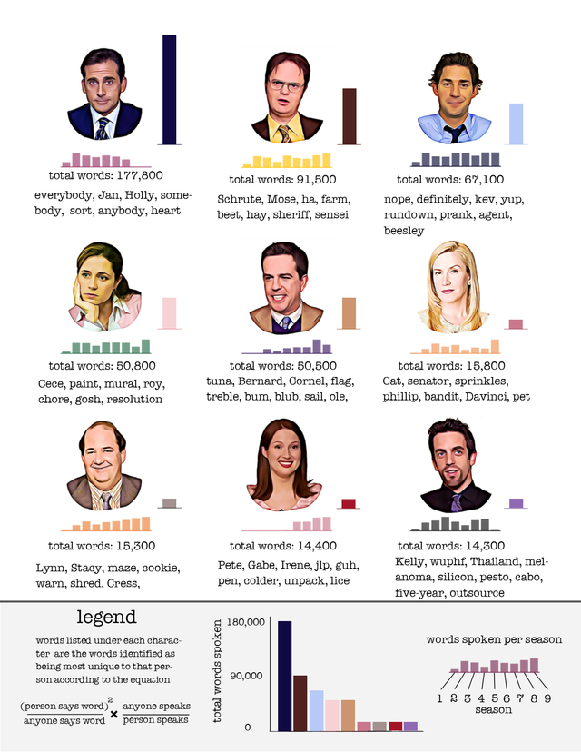

```{r, warning = FALSE, message = FALSE}
library(dplyr)
library(ggplot2)
library(tidytext)
library(rtweet)
library(circlize) # https://jokergoo.github.io/circlize_book/book/
library(ComplexHeatmap) # https://jokergoo.github.io/ComplexHeatmap-reference/book/a-single-heatmap.html

load("data/transcripts.RData")
load("data/ratings.RData")
```

## Proposta inicial

Inicialmente, minha ideia era utilizar dados do twitter (texto e hora do tweet) de alguma partida de futebol e comparar a frequência de determinadas palavras com os eventos do jogo. 

No entanto, um problema que surgiu foi que a api gratuita do Twitter aparentemente não retorna tweets de maneira constante ao decorrer da partida. Segue um exemplo em que temos tweets apenas para alguns intervalos de tempo do jogo.
```{r, dpi = 300, warning = FALSE, message = FALSE}
tweets = parse_stream("CEAxFLU.json")
ts_plot(tweets, by = "mins") + # função do rtweet que utiliza o ggplot
  theme_bw()
```

Este problema me fez desistir da proposta inicial e buscar outras opções para o trabalho final.

## Nova ideia

Alguns meses atrás, navegando no Reddit, encontrei uma visualização que me chamou bastante atenção:



na época, eu estava estudando mineração de textos e tive a ideia de utilizar métodos de text mining para buscar palavras que identifiquem cada personagem e avaliar a relação entre a quantidade de falas de um personagem em um episódio com a nota do episódio no IMDB. Como eu nunca assisti The Office, a série desta visualização, decidi utilizar os dados da série 
<a href="https://en.wikipedia.org/wiki/Avatar:_The_Last_Airbender">Avatar: The Last Airbender (ATLA)</a>. Grande parte do trabalho de obtenção e limpeza dos dados assim como a parte de mineração de textos já estava pronta, porém eu não havia feito praticamente nenhuma visualização para este projeto. Desse modo, optei por continuar este projeto fazendo as visualizações neste trabalho final.


## Datasets

Os datasets que serão utilizados são:

+ O script dos 61 episódios do ATLA disponível em: http://avatar.wikia.com/wiki/Avatar_Wiki:Transcripts;

+ As notas do IMDB desta série que pode ser encontrada em: https://www.imdb.com/title/tt0417299/.

Ambos os conjuntos de dados foram coletados via web scraping. O código do scrape está no arquivo <a href="scrape.R">scrape.R</a>.

Data frame do roteiro
```{r}
transcripts
```

Data frame das ratings
```{r}
ratings
```

## Principais palavras por personagem

Inicialmente, realizei um pre-processamento nos textos, removi as introduções e tudo que estava entre colchetes.

Exemplo de texto antes da limpeza
```{r}
transcripts$text[2]
```

```{r}
intro = transcripts$text[1]

transcripts = transcripts %>%
  filter(text != intro) %>% # tirando as introducoes
  mutate(text = stringr::str_replace_all(text, '\\[(.*?)\\]', ''), # tirando o que ta entre colchetes
         text = qdapRegex::rm_number(text))
```

Exemplo de texto depois da limpeza
```{r}
transcripts$text[1] # índice 1 pois removi a introdução
```

Agora, colocarei o texto no formato de um data frame de uma palavra por linha, com todas as palavras em caixa baixa e removerei as seguintes stop words:
```{r}
sort(unique(stop_words$word))
```

```{r}
ut = transcripts %>%
  unnest_tokens(word, text) %>% 
  anti_join(stop_words, by = "word") # retirando stop words
```

```{r}
ut
```

Contagem de palavras por personagem (após remoção de stop words):
```{r}
count_speaker = ut %>%
  count(speaker) %>%
  arrange(desc(n))
count_speaker
```

Como nesta série cada personagem tem uma origem ligada a um dos quatro elementos (água, fogo, terra e ar), optei por inserir esta informação nas visualizações.

As cores selecionadas foram escolhidas a partir da vestimenta dos personagens e da seguinte imagem:


```{r}
water = "#27A3EB"
fire = "#D7333C"
earth = "#6FCC36"
air = "gold1"
```

```{r}
personagens = count_speaker$speaker[1:18]
origin = tibble(speaker = personagens, origin = c("water", "air", "water", "fire", "fire", "earth", "fire", "fire", "earth", "water", "air", "fire", "fire", "earth", "water", "earth", "earth", "fire"))
origin
```

```{r, fig.width = 10, dpi = 300, warning = FALSE, message = FALSE}
count_speaker$Selecionado = "Não"
count_speaker$Selecionado[1:18] = "Sim"
n_outros = sum(count_speaker$n[which(count_speaker$Selecionado == "Não")])
count_speaker %>%
  head(24) %>%
  rbind(tibble(speaker = "Outros", n = n_outros, Selecionado = "Não")) %>%
  mutate(speaker = factor(speaker, levels = speaker)) %>%
  ggplot(aes(x = speaker, y = n, alpha = Selecionado, fill = speaker)) +
  geom_bar(stat = "identity") +
  xlab("Personagem") +
  ylab("Quantidade de palavras") +
  theme_bw() +
  theme(axis.text.x = element_text(angle = 90, vjust = 0.3)) +
  scale_alpha_discrete(range = c(0.3, 0.9)) +
  ggtitle("Quantidade de palavras por personagens e personagens selecionados") +
  guides(alpha = guide_legend(reverse = TRUE), fill = FALSE) +
  scale_fill_manual(values = c(water, air, water, fire, fire, earth,
                               fire, fire, earth, water, air, fire,
                               fire, earth, water, earth, earth, fire,
                               earth, water, fire, fire, fire, water, "black"))
```

Optei por utilizar apenas os 18 personagens com maior número de palavras e calcular as palavras mais utilizadas e a medida tf-idf considerando cada personagem como um documento. A medida tf-idf nos permite avaliar palavras que caracterizam um determinado documento, neste caso personagem, em relação a um conjunto de documentos. Ela é calculada da seguinte forma:

$$ w_{t,d} = \frac{tf_{t,d}}{\sum_{t' \in d}f_{t',d}} \times log \Bigg( \frac{N}{n_t} \Bigg) $$

em que

+ $w_{t,d}$ é o valor do o peso \textit{tf-idf} para o termo $t$ no documento $d$;

+ $tf_{t,d}$ é a quantidade de vezes que o termo $t$ aparece no documento $d$;

+ $\sum_{t' \in d}f_{t',d}$ é a quantidade total de termos do documento $d$;

+ $N$ é o número total de documentos;

+ $n_t$ é o número de documentos que contém o termo $t$.

```{r}
tfidf = ut %>%
  filter(speaker %in% personagens) %>%
  count(word, speaker) %>%
  bind_tf_idf(word, speaker, n) %>%
  arrange(desc(tf_idf))
```

Visualizando as palavras mais utilizadas e os maiores tf-idf por personagem
```{r}
tmp1 = tibble(speaker = count_speaker$speaker[1:18], 
                   order_speaker = 1:18)

tmp2 = tfidf %>%
  inner_join(tmp1, by = "speaker") %>%
  mutate(speaker = reorder(speaker, order_speaker)) %>%
  arrange(speaker, desc(n)) %>%
  group_by(speaker) %>%
  do(head(., 10)) %>%
  ungroup() %>%
  arrange(speaker, n) %>%
  mutate(order_word = row_number())

tmp3 = tfidf %>%
  inner_join(tmp1, by = "speaker") %>%
  mutate(speaker = reorder(speaker, order_speaker)) %>%
  arrange(speaker, desc(tf_idf)) %>%
  group_by(speaker) %>%
  do(head(., 10)) %>%
  ungroup() %>%
  arrange(speaker, tf_idf) %>%
  mutate(order_word = row_number())
```

```{r, fig.width = 10, fig.height = 10, dpi = 300}
tmp2 %>%
  ggplot(aes(x = order_word, y = n, fill = speaker)) +
  geom_bar(stat = "identity", show.legend = FALSE) +
  facet_wrap(~ speaker, scales = "free", ncol = 6) +
  theme_bw() +
  scale_x_continuous(breaks = tmp2$order_word, labels = tmp2$word) +
  scale_y_continuous(breaks = scales::pretty_breaks(2)) +
  coord_flip() +
  labs(title = "Palavras mais utilizadas por personagens",
       x = NULL,
       y = "n") +
  scale_fill_manual(values = c(water, air, water, fire, fire, earth,
                               fire, fire, earth, water, air, fire,
                               fire, earth, water, earth, earth, fire))
```

```{r, fig.width = 10, fig.height = 10, dpi = 300}
tmp3 %>%
  ggplot(aes(x = order_word, y = tf_idf, fill = speaker)) +
  geom_bar(stat = "identity", show.legend = FALSE) +
  facet_wrap(~ speaker, scales = "free", ncol = 6) +
  xlab("words") +
  ylab("tf-idf") +
  theme_bw() +
  scale_x_continuous(breaks = tmp3$order_word, labels = tmp3$word) +
  scale_y_continuous(breaks = scales::pretty_breaks(2)) +
  coord_flip() +
  labs(title = "Palavras com maiores tf-idf por personagem",
       x = NULL,
       y = "tf-idf") +
  scale_fill_manual(values = c(water, air, water, fire, fire, earth,
                               fire, fire, earth, water, air, fire,
                               fire, earth, water, earth, earth, fire))
```

Finalmente, fiz uma visualização da matriz de frequência dos termos destes personagens utilizando análise de agrupamentos hierárquica para fazer a ordenação das linhas e colunas desta matriz.
```{r, fig.width = 10, fig.height = 10, dpi = 300}
mat = reshape2::acast(tfidf, word ~ speaker, value.var = "tf", fill = 0) 
rownames(mat) = rep("", nrow(mat)) 
heatmap(mat, main = "Matriz das frequências dos termos por personagem")
```

O que chama a atenção nesta matriz é que existem diversos termos que são utilizados apenas por um único personagem.

Exemplo de termos que apenas o personagem "Sokka" disse:

```{r}
sokka = ut %>%
  filter(speaker == "Sokka") %>%
  count(word)

not_sokka = ut %>%
  filter(speaker != "Sokka") %>%
  select(word) %>%
  distinct(.keep_all = TRUE)

sokka %>%
  anti_join(not_sokka, by = "word") %>%
  arrange(desc(n))
```

## Relação entre a quantidade de palavras dos personagens e notas do IMDB

Primeiramente, agrupei as informações das notas com a base do roteiro e criei uma variável para indicar a quantidade de palavras dos personagens por episódio.
```{r}
tmp = tibble(epi_num = unique(transcripts$epi_num), rating = ratings$rating)

words_epi = ut %>%
  inner_join(tmp, by = "epi_num") %>%
  filter(speaker %in% personagens) %>%
  count(epi_num, rating, speaker)

words_epi
```
Por exemplo o personagem Aang disse 125 palavras (com remoção de stop words) no episódio 1.

Agora, visualizamos a base com as notas dos episódios e a quantidade de falas dos personagens por episódio.
```{r, dpi = 300, fig.width = 12}
ratings$Temporada = as.factor(c(rep("1: Air", 20), rep("2: Earth", 20), rep("3: Fire", 21)))

ratings %>%
  ggplot(aes(x = epi_num, y = rating, fill = Temporada)) +
  geom_bar(stat = "identity") +
  scale_fill_manual(values = c(water, earth, fire)) +
  theme_bw() +
  coord_cartesian(ylim = c(0, 10)) +
  ggtitle("Nota do IMDB por episódio") +
  xlab("Episódio") +
  ylab("Nota") +
  scale_x_continuous(expand = c(0, 0)) +
  scale_y_continuous(expand = c(0, 0))
```

```{r, warning = FALSE, message = FALSE}
tmp4 = reshape2::acast(words_epi, epi_num ~ speaker, value.var = "n", fill = 0) %>%
  reshape2::melt()
names(tmp4) = c("epi_num", "speaker", "n")
tmp4 = tmp4 %>%
  inner_join(tmp1, by = "speaker") %>%
  mutate(speaker = reorder(speaker, order_speaker)) 
```

```{r, fig.width = 14, fig.height = 14, dpi = 300}
tmp4 %>%
  ggplot(aes(x = epi_num, y = n, fill = speaker)) +
  geom_bar(stat = "identity", show.legend = FALSE) +
  facet_wrap(~ speaker, scales = "free", ncol = 3) +
  ylim(0, 300) +
  theme_bw() +
  scale_fill_manual(values = c(water, air, water, fire, fire, earth,
                               fire, fire, earth, water, air, fire,
                               fire, earth, water, earth, earth, fire)) +
  ggtitle("Quantidade de palavras por episódio") +
  xlab("Episódio") +
  ylab("Quantidade de palavras") +
  scale_x_continuous(expand = c(0, 0))
```

Posteriormente, calculei a correlação de Spearman entre a proporção de falas do personagem e a nota do IMDB. Preferi utilizar esta medida de correlação ao invés da correlação de Pearson pois não espero que a correlação entre estas variáveis seja linear visto que existem muitos personagens que não possuem falas em diversos episódios.
```{r}
f <- function(personagem) {
  out = NULL
  for(i in 1:61) {
    tmp = words_epi %>%
      filter(speaker == personagem,
             epi_num == i) %>%
      .$n
    out[i] = ifelse(length(tmp) == 0, 0, tmp)
  }
  out
}

mat2 = ratings$rating %>%
  cbind(sapply(personagens, f))
colnames(mat2)[1] = "rating"

mat_rating = cor(mat2, method = "spearman")

cor_rating = mat_rating[-1, 1]

sort(cor_rating, decreasing = TRUE)
```

```{r, fig.width = 10, dpi = 300}
tibble(spearman = cor_rating, speaker = names(cor_rating)) %>%
  inner_join(origin, by = "speaker") %>%
  mutate(speaker = reorder(speaker, spearman)) %>%
  ggplot(aes(speaker, spearman, fill = origin)) +
  geom_bar(stat = "identity") +
  xlab("Personagem") +
  ylab("Correlação de Spearman") +
  ggtitle("Correlações de Spearman entre a quantidade de palavras do personagem por episódio e notas do IMDB") +
  theme_bw() +
  scale_y_continuous(breaks = scales::pretty_breaks(3)) +
  scale_fill_manual(values = c("water" = water, "fire" = fire, "air" = air, "earth" = earth)) +
  guides(fill = FALSE) +
  theme(axis.text.x = element_text(angle = 90, vjust = 0.3))
```

Nota-se que o personagem com maior correlação entre quantidade de palavras e nota do IMDB é Ozai, o principal vilão, enquanto que as menores correlações são de Katara, Aang e Sokka que aparecem na grande maioria dos episódios, inclusive nos episódios menos populares.

## Relações entre os personagens

Utilizando a matriz de correlação criada na seção anterior, podemos remover a linha e a coluna do rating e buscar personagens que tendem a ter quantidades de falas similares nos mesmos episódios.

```{r, fig.width = 10, fig.height = 10, dpi = 300}
Heatmap(mat_rating[-1,-1], name = "Correlação", column_title = "Matriz de correlação das quantidades de palavras por episódio")
```

Podemos ver que as maiores similaridades estão entre Azula/Mai e Sokka/Katara. O que faz sentido visto que estes pares tendem a aparecer juntos nos episódios.

Também criei uma matriz de correlação utilizando os vetores tf-idf e verifiquei a correlação entre os personagens utilizando este vetores e a similaridade do cosseno.
```{r, fig.width = 10, fig.height = 10, dpi = 300}
mat_tfidf = reshape2::acast(tfidf, word ~ speaker, value.var = "tf_idf", fill = 0) 
cos = lsa::cosine(mat)
Heatmap(cos, name = "Similaridade", column_title = "Matriz da similaridade do cosseno entre os vetores tf-idf",
        col = colorRamp2(c(0, 1), c("white", "red")))
```

Nota-se uma similaridade alta entre os personagens Katara, Toph, Aang e Sokka, e entre os personagens Azula, Zuko, Ozai, Iroh e Zhao. O primeiro destes grupos é formado pelos alguns dos principais protagonistas da série enquanto que o segundo é composto exclusivamente de personagens da nação do fogo. Também observamos no dendrograma que o personagem Pathik possui o vocabulário mais único visto que ele só se une a outros grupos na última iteração da clusterização hierárquica, o que pode ser visto no gráfico do tf-idf por personagem.

Posteriormente, considerei apenas as palavras referentes aos nomes dos 18 personagens selecionados e ilustrei a quantidade de vezes que um personagem diz o nome de outro. Note que a diferença das alturas indicam a direção das falas.
```{r}
tmp6 = tfidf %>%
  filter(word %in% stringr::str_to_lower(c(personagens, "feng"))) %>%
  mutate(speaker = stringr::str_to_lower(speaker))
tmp6$speaker[which(tmp6$speaker == "long feng")] = "feng"

mat3 = reshape2::acast(tmp6, speaker ~ word, value.var = "n", fill = 0) 

colnames(mat3) = c("Aang", "Azula", "Bumi", "Feng", "Hakoda", "Hama", "Iroh",
                  "Jet", "Katara", "Mai", "Ozai", "Pathik", "Roku", "Sokka",
                  "Suki", "Toph", "Zhao", "Zuko")
rownames(mat3) = colnames(mat3)
```

```{r, fig.width = 20, fig.height = 20, dpi = 300}
grid.col = c(Aang = air, Azula = fire, Bumi = earth, Feng = earth, Hakoda = water,
             Hama = water, Iroh = fire, Jet = earth, Katara = water, Mai = fire,
             Ozai = fire, Pathik = air, Roku = fire, Sokka = water, Suki = earth,
             Toph = earth, Zhao = fire, Zuko = fire)

circos.clear()
circos.par(start.degree = 90, clock.wise = TRUE)
chordDiagram(mat3, grid.col = grid.col, annotationTrack = c("name", "grid"), directional = 1, diffHeight = uh(7), order = c("Pathik", "Aang", "Katara", "Sokka", "Hakoda", "Hama", "Toph", "Bumi", "Feng", "Jet", "Suki", "Zuko", "Roku", "Ozai", "Iroh", "Azula", "Mai", "Zhao"))
title("Menções dos nomes de personagens por outros personagens")
```

Novamente, vemos uma ligação grande entre os personagens Aang, Katara e Sokka pois eles são os principais personagens do show. Também chama a atenção as menções do nome Zuko pelos personagens da nação do fogo e a ligação entre Suki e Sokka, que são amantes no show. Finalmente, vale a pena ressaltar outras relações como a de Hakoda, pai de Sokka e Katara, com seus filhos e de personagens que aparecem em poucos episódios e dialogam praticamente com apenas um outro personagem, como é o caso de Hama e Pathik, que apresentam ligações fortes com Katara e Aang, respectivamente.

## Referências

Além das imagens citadas anteriormente que serviram de inspiração para o tema e para as cores utilizadas nos gráficos, alguns artigos foram importantes para o desenvolvimento deste trabalho. Inicialmente, em Jänicke et al. (2016), uma survey de diversas técnicas de visualização para dados textuais, verificou-se que as visualizações aqui utilizadas são visualizações de "distant reading" pois estamos interessados nas características globais do texto como a quantidade de palavras utilizadas pelos personagens. Esta survey ainda sugere a utilização de uma nuvem de palavras como alternativa para os gráficos de quantidade de palavras e tf-idf utilizados neste trabalho, no entanto, uma nuvem de palavra para cada personagem dificultaria a comparação entre eles.

O conceito de reordenação das matrizes dos dados com o intuito de buscar padrões é discutido em Bertin (1983) e também serviu de influência para este trabalho como um todo enquanto que Klein (2012), um artigo encontrado na survey citada anteriormente, apresenta uma visualização de um grafo para evidenciar as relações sociais de Thomas Jefferson, de maneira similar ao diagrama de Chord empregado para evidenciar as relações entre os personagens.


BERTIN, Jacques. **Semiology of graphics**; diagrams networks maps. 1983.

JÄNICKE, Stefan et al. Visual text analysis in digital humanities. In: **Computer Graphics Forum**. 2017. p. 226-250.

KLEIN, Lauren F. Social Network Analysis and Visualization in'The Papers of Thomas Jefferson'. In: **DH**. 2012. p. 254-255.


